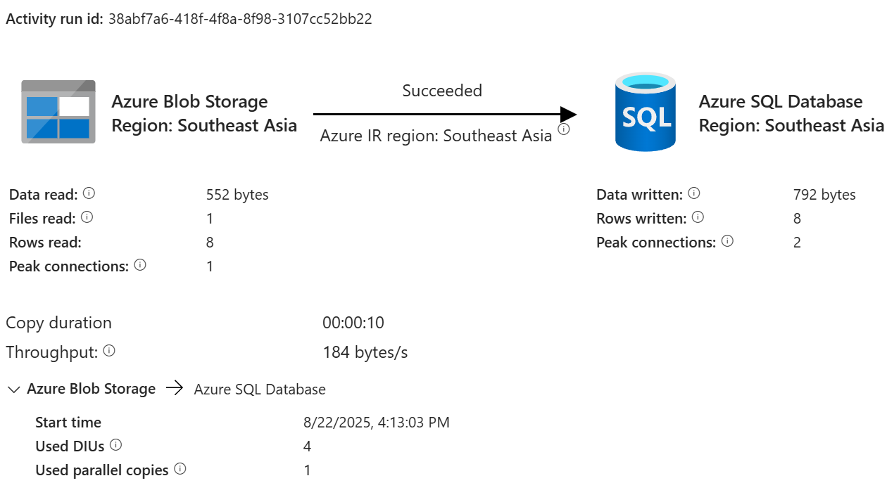
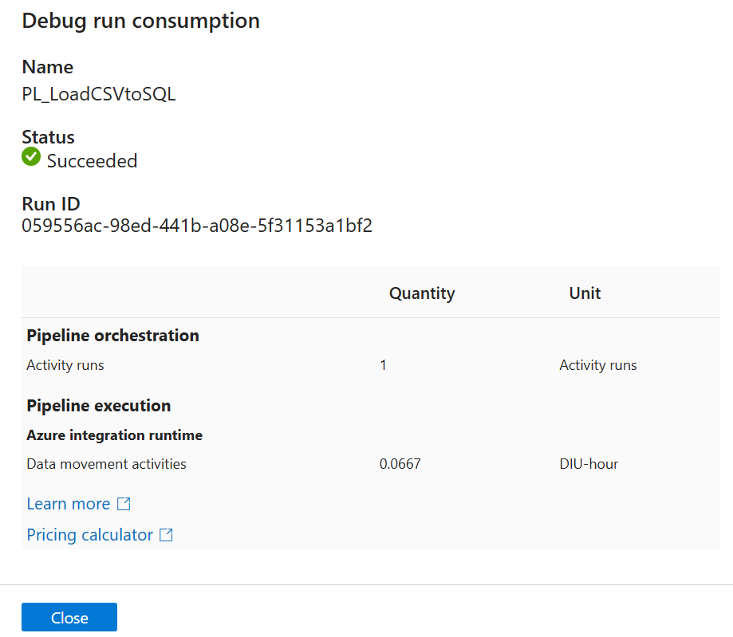
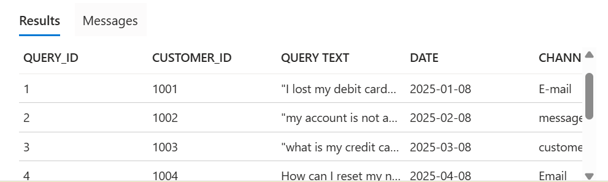

# Banking Customer Query Analytics Pipeline

## 📌 Project Description
This project demonstrates an **end-to-end ETL pipeline** using **Azure Data Factory (ADF)** to load banking customer queries from CSV files into **Azure SQL Database** for analytics.

The pipeline was tested successfully with **8 rows copied** from a sample CSV into SQL.

---

## 🎯 Objective
- Automate loading of banking customer queries from raw CSV files  
- Learn and showcase Azure Data Factory pipeline design  
- Validate data ingestion into Azure SQL Database  
- Document and publish project for GitHub portfolio  

---

## 🏗️ Architecture Diagram

---

## ⚙️ Tech Stack
- **Azure Data Factory** – ETL pipeline orchestration  
- **Azure Storage Account** – CSV source files  
- **Azure SQL Database** – sink table for customer queries  
- **Integration Runtime** – AutoResolveIntegrationRuntime  

---

## 🔄 Pipeline Workflow
1. **Source**: Customer queries stored in Azure Blob Storage (CSV).  
2. **ADF Pipeline**: Copy Activity moves data from Storage → SQL.  
3. **Sink**: Data stored in `dbo.CustomerQueries` table.  
4. **Execution**: Pipeline triggered manually for testing.  
5. **Monitoring**: Run validated in ADF Monitor tab.  

---

## 📂 Folder Structure
ADF_Pipeline_Project/
│
├── README.md # Project documentation
├── ADF_Pipelines/ # Exported pipeline JSON
│ └── pipeline.json
├── Sample_Data/ # Input CSV data
│ └── customer_queries.csv
├── Screenshots/ # Screenshots of pipeline and results
│ ├── pipeline_design.png
│ ├── debug_run.png
│ ├── monitor_tab.png
│ └── sql_table.png
└── Diagrams/ # Architecture diagram
└── architecture.png

---

## ⚙️ Pipeline Steps
1. **Create Linked Services**  
   - Azure Blob Storage (source)  
   - Azure SQL Database (sink)  

2. **Create Datasets**  
   - Source dataset → `customer_queries.csv`  
   - Sink dataset → SQL table `CustomerQueries`  

3. **Build Pipeline**  
   - Copy Activity: Blob → SQL  

4. **Run & Monitor**  
   - Debug → verify row copy  
   - Trigger Now → run pipeline  
   - Monitor → confirm success  

---

## 📊 Sample Data
Sample banking customer query data was used in CSV format.  
Example columns:  
- QUERY_ID  
- CUSTOMER_ID  
- QUERY_TEXT  
- DATE  
- CHANNEL  

---

## 🖼️ Screenshots

### 🔹 Pipeline Design

### 🔹 Debug Run (Rows Copied = 8)

### 🔹 Monitor Tab (Successful Pipeline Run)

### 🔹 SQL Table with Data

---

## 🧑‍💻 Skills Demonstrated
- **ETL pipeline design** in Azure Data Factory  
- Creation of **linked services, datasets, and sink tables**  
- Running pipelines with **debug and trigger now**  
- **Monitoring** pipeline runs and validating data load  
- Documenting project and publishing on **GitHub**  

---

## ✅ Outcome
- 8 rows successfully ingested from **CSV → Azure SQL Database**  
- Fully documented project with pipeline JSON, sample data, and screenshots  
- Ready-to-showcase portfolio project for **Azure Data Engineer** roles  
